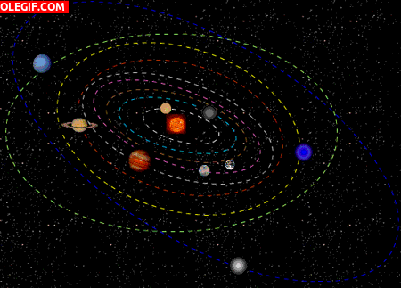

<p align="center"></p>

<h1 align="center">Planetas API</h1>

<h3 align="center">
API REST de código aberto para dados de consulta de  pesquisa  as informações nelas contidadas com o objetivo de estabelecer resultados relevantes
<p align="center">
 
<a href="https://app.travis-ci.com/Mario23junior/solar-system-api.svg?branch=main" target="_blank"> [](https://app.travis-ci.com/Mario23junior/solar-system-api.svg?branch=main)
<a href="https://en.wikipedia.org/wiki/Representational_state_transfer"></a>
</p>
  
## Primeiro execute o maven 

## 🚀 Começando

Algums parametros de ação são necessarios para a execução
### 📋 Pré-requisitos
 
* [Java17](http://www.dropwizard.io/1.0.2/docs/)
* [Spring boot](https://spring.io/projects/spring-boot)
* [H2](https://www.h2database.com/html/main.html)
* [Swagger](https://swagger.io/)
* [openJDK](https://maven.apache.org/)
* [Heroku](https://www.heroku.com/free)

 
### 🔧 Instalação 🛠️ 

Uma série de exemplos passo-a-passo que informam o que você deve executar para ter um ambiente de desenvolvimento em execução.

Diga como essa etapa será:

```
java -jar target/planetas-0.0.1-SNAPSHOT.jar

```
 
 ###  Documentação  
```
http://localhost:8080/swagger-ui.html
```


## Uso

```

```

## Resultado dos dados da API

``` json
[
    {
        "id": 1,
        "urlImage": "https://www.nasa.gov/centers/goddard/images/content/387520main_92_80_1-334x312.gif",
        "nome": "Júpiter",
        "areaSuperficie": "6,142 × 10^10 km²",
        "raio": 69.911,
        "distanciaDoSol": 778500.0,
        "duracaoDoDia": "0d 9h 56m",
        "descricao": "Júpiter é composto principalmente de hidrogênio, sendo um quarto de sua massa composta de hélio, embora o hélio corresponda a apenas um décimo do número total de moléculas.",
        "caracteristicasFisicasDto": [
            {
                "id": 4,
                "diametroEquatorial": "142.984 ± 8",
                "volume": 1.3213,
                "massa": 317.8,
                "densidadeMedia": 1.326,
                "gravidadeEquatorial": 2.528,
                "temperatura": -108,
                "planetasDto": null
            }
        ],
        "caracteristicasOrbitaisDto": [
            {
                "id": 3,
                "afelio": 816.5208,
                "excentricidade": 0.048775,
                "perioDoOrbital": 4.331572,
                "numeroDeSatelitesNaturais": 79,
                "gravidade": 24.79,
                "periodoDeRotacao": 9.8,
                "planetasDto": null
            }
        ],
        "composicaoAtmosfericasDto": [
            {
                "id": 2,
                "hressaoAtmosferica": "20-200 KPa",
                "hidrogenio": "89,8±2,0",
                "helio": "10,2±2,0",
                "metano": 0.3,
                "amonia": 0.026,
                "fosforo": 6.0E-4,
                "vaporDeAgua": 0.25,
                "planetasDto": null
            }
        ],
        "luasDto": [
            {
                "id": 5,
                "nome": "Ganímedes",
                "urlImage": "https://upload.wikimedia.org/wikipedia/commons/a/a9/Ganymede_Rotation_Movie.gif",
                "periastro": 1.0692,
                "excentricidade": 0.0013,
                "diametroEquatorial": 5.2624,
                "massa": "1.4819 × 10^23",
                "descricao": "Ganímedes ou Ganimedes, também chamado Júpiter III, é o principal satélite natural de Júpiter, sendo também o maior satélite natural do Sistema Solar",
                "planetasDto": null
            }
        ]
    }
]
 
```
 
## 📄 Licença
 
Este projeto está sob a licença (GNU GPLv3) - [GNU GPLv3.md](https://www.gnu.org/licenses/gpl-3.0.pt-br.html)
